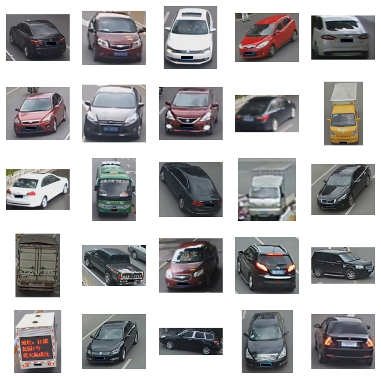
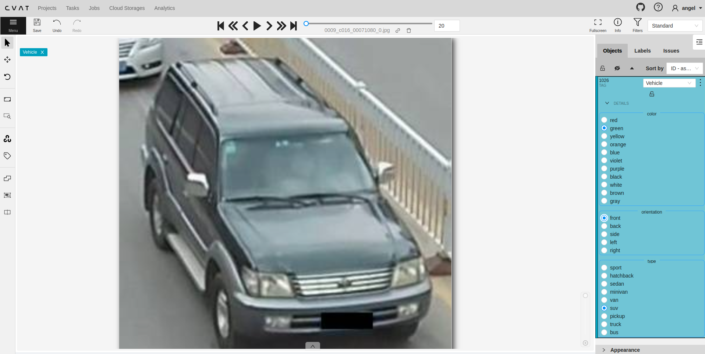
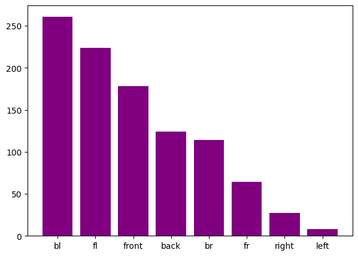
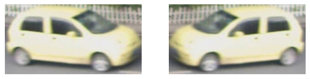
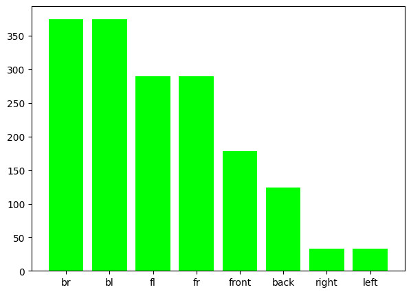

# Car Grouping
## In this repo I will walk you through the process of creating a classificator for grouping cars based on their features.
-------------------------------------------
The idea is to explore the data, analyze and extract significat features for grouping based on a classification task.

Table of contents
-----------------
* [Data Exploration](#exploration)    
* [Model Training](#model)
* [Demo: YOLOv4](#yolov4)
* [Demo: Running the App](#app)

<a name="exploration"></a>
Data Exploration
------------
We will start by downloading the data through SSH and consequently exploring it.

1. Using SFTP, connect.
    
    ```shell
    $ sftp stdatalabelling.techchallenge.techchallenge@stdatalabelling.blob.core.windows.net
    ```

2. Type password: *NICKUeWQuX+O815kMn8BIgcx5rDHJCNA*. 

3. Download to local.
    
    ```shell
    $ get image_test.tar.gz
    ```
4. Explore data

    When reading all the images inside our directory, you can see that there are more than 11.5 k images without labels. So this is a problem, because labeling everything will take quite some time, so we need a strategy.
    * First we need to set an ideal number of images to create a subset. A reasonable number is **1k** images.
    * Now because we dont have pre-defined labels, we do not have a way of creating a balanced dataset taking into account the feature we want to detect/classify. So, given this issue, we will have to **randomly sample a subset** to obtain somewhat of a representative distrubution.

        

        **NOTE: I found the dataset using reverse image search but I assume that is not the goal so I will continue with the described strategy**
    * For creating the labels, I will be using an open source lib called **CVAT**.

5. Labeling strategy

    Before starting with the data labeling, lets use CVAT to explore our subset and create a strategy based on it. The idea is to create a superclass named vehicle with certain attributes. To be specific: color, type, and orientation. 

    - Color: I will be using the basic colors. Also to note, here we assume the vehicle has a single tone paint and we select the primary color. Some cars may have a mixture of colors and this is something to consider during the creation of the output and the loss criteria. 
        - Red, green, yellow, orange, blue, purple, black, white, brown, and gray.
    - Type: There are many types, some of them overlap, so lets use a simplified version.
        - Hatchback, sedan, minivan, van, suv, pickup, truck, and bus.
    - Orientation: I believe a good approach would be to use cardinal points with respect to the camera and then transform (rotate) to world frame. We do not have this info, so I'll adapt it to the camera perspective. An even better solution might be running a 3D detector and use the yaw angle for orientation, or a solution based on a pair of keypoints (solving for the slope or using a camera model). It is more of a continuous problem than a discrete. 
        - Front, back, left, right
        - Front-left, front-right, back-left, back-right

        

6. Dataset augmentation

    After labeling 1k images, I export it as a json file using Datumaro format. Now lets visualize the data. We expect to have unbalanced data because of the way we needed to sample. The categories are: color, type and orientation. Two of them, color and type cannot be just simply augmented, for this you will need to go back to the whole dataset and handpick to balance. Although, orientation is something we can try to balance with image flipping. 
    
    - Before 
        - 

    - We can flip arround the **Y axis** to balance the orientations (except for front and back).
        - 

    - After
        - 

<a name="model"></a>
Model Training
------------