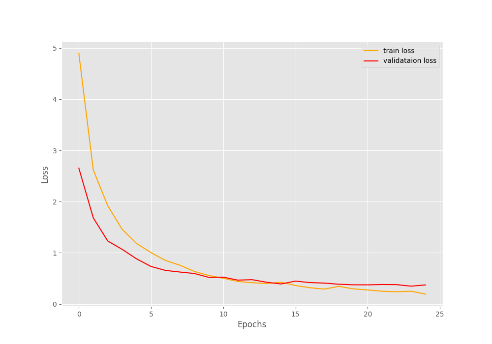

# Car Grouping
## In this repo I will walk you through the process of creating a classificator for grouping cars based on their features.
-------------------------------------------
The idea is to explore the data, analyze and extract significat features for grouping based on a classification task. Refere to **solution.ipynb** for the step by step.

Table of contents
-----------------
* [Prerequisite](#prerequisite)
* [Data Exploration](#exploration)    
* [Model Training](#model)
* [Model Testing](#metrics)
* [Optimization](#optimization)
* [Deployment](#deployment)

<a name="prerequisite"></a>
Prerequisite
------------

If you are planning on following the steps inside **solution.py** notebook, install the libraries with **requirements.txt**.
- ```shell
    $ pip3 install -r requirements.txt
    ```

<a name="exploration"></a>
Data Exploration
------------
We will start by downloading the data through SSH and consequently exploring it.

1. Using SFTP, connect.
    
    ```shell
    $ sftp stdatalabelling.techchallenge.techchallenge@stdatalabelling.blob.core.windows.net
    ```

2. Type password: *NICKUeWQuX+O815kMn8BIgcx5rDHJCNA*. 

3. Download to local.
    
    ```shell
    $ get image_test.tar.gz
    ```
4. Explore data

    When reading all the images inside our directory, you can see that there are more than 11.5 k images without labels. So this is a problem, because labeling everything will take quite some time, so we need a strategy.
    * First we need to set an ideal number of images to create a subset. A reasonable number is **1k** images.
    * Now because we dont have pre-defined labels, we do not have a way of creating a balanced dataset taking into account the feature we want to detect/classify. So, given this issue, we will have to **randomly sample a subset** to obtain somewhat of a representative distrubution.

        

        **NOTE: I found the dataset using reverse image search but I assume that is not the goal so I will continue with the described strategy**
    * For creating the labels, I will be using an open source lib called **CVAT**.

5. Labeling strategy

    Before starting with the data labeling, lets use CVAT to explore our subset and create a strategy based on it. The idea is to create a superclass named vehicle with certain attributes. To be specific: color, type, and orientation. 

    - Color: I will be using the basic colors. Also to note, here we assume the vehicle has a single tone paint and we select the primary color. Some cars may have a mixture of colors and this is something to consider during the creation of the output and the loss criteria. 
        - Red, green, yellow, orange, blue, purple, black, white, brown, and gray.
    - Type: There are many types, some of them overlap, so lets use a simplified version.
        - Hatchback, sedan, minivan, van, suv, pickup, truck, and bus.
    - Orientation: I believe a good approach would be to use cardinal points with respect to the camera and then transform (rotate) to world frame. We do not have this info, so I'll adapt it to the camera perspective. An even better solution might be running a 3D detector and use the yaw angle for orientation, or a solution based on a pair of keypoints (solving for the slope or using a camera model). It is more of a continuous problem than a discrete. 
        - Front, back, left, right
        - Front-left, front-right, back-left, back-right

        

6. Dataset augmentation

    After labeling 1k images, I export it as a json file using Datumaro format. Now lets visualize the data. We expect to have unbalanced data because of the way we needed to sample. The categories are: color, type and orientation. Two of them, color and type cannot be just simply augmented, for this you will need to go back to the whole dataset and handpick to balance. Although, orientation is something we can try to balance with image flipping. 
    
    - Before 
        - 

    - We can flip arround the **Y axis** to balance the orientations (except for front and back).
        - 

    - After
        - 

<a name="model"></a>
Model Training
------------
Now that we are ready for training the model, there are a couple of design decisions we need to think about.

For example, what model or models are optimal for solving it. The classification task is considered sparse, while object detection/segmentation are dense. For this reason, we can use a simpler architectures. Resnet18 is a good candidate as it capable of learning the desired fuction, with a reduced dataset, and it can be scale if necessary. So lets go with the efficient yet powerful architecture. 

On the other hand, how do we solve the multiple classification task? Well, in my opinion there are two obvious paths. The first is to concatenate and one-hot encode the multiple classidications task into a multi-label classification. Applying binary cross entropy to each node.

    
    For example: Color:[0,0,1]; Type:[0,1,0]; Orientation:[1,0,0] -> Multi-label[0,0,1,0,1,0,1,0,0] 

The other solution is to create a multi-head model. For me, this is the best approach as you have more control over specific individual task. For example, you could use a keypoint estimator for the orientation, and a classificator for the color and type. For simplicity reasons, we will stick with the predefined classification task but each will have its own head and loss function. We have multiple labels for each class, but they are mutually exclusive, so we can use softmax plus cross entropy and sum the 3 loss criterias.
- Example    
    - 

Finally, what training strategy should we use?
- Augmentation 
    - Because color is part of the classification, we need to be careful with aggresive augmentations, specially in the color space. So the plan is to do some moderate transformations like rotation, translation, brightness, etc...
```python
    A.Rotate(limit=20, p=0.25),
    A.IAAAffine(shear=15, scale=1.0, mode="constant", p=0.2),
    A.RandomBrightnessContrast(contrast_limit=0.5, brightness_limit=0.5, p=0.25)
    A.OneOf([,
        A.GaussNoise(p=0.8),
        A.ImageCompression(p=0.8),
        A.RandomGamma(p=0.8),
        A.Blur(p=0.8),
    ], p=1.0),
    A.ShiftScaleRotate(shift_limit=0.3, scale_limit=0.3, rotate_limit=0, p=0.5),
    A.Resize(width=IMAGE_SIZE, height=IMAGE_SIZE),
    A.Normalize(
        mean=[0.485, 0.456, 0.406],
        std=[0.229, 0.224, 0.225]),
    ToTensorV2()
 ```
- Parameters and Hyperparameters
    - To avoid overfitting we will use 25 epochs and resize all images to standard 128x128 pixels.
 ```python
    PRE_TRAIN = True
    LEARNING_RATE = 1e-4
    WEIGHT_DECAY = 5e-4
    BATCH_SIZE = 64
    NUM_EPOCHS = 25
    IMAGE_SIZE = 128

    loss_fn = nn.CrossEntropyLoss()
    optimizer = optim.Adam(model.parameters(), lr=config.LEARNING_RATE, weight_decay=config.WEIGHT_DECAY)

    loss=loss1+loss2+loss3
```
- Model Architectureoptimization

    
```python
    self.fc1 = nn.Linear(512, 10)  #For color class
    self.fc2 = nn.Linear(512, 8)    #For type class
    self.fc3 = nn.Linear(512, 8)    #For orientation class
    ================================================================
    Total params: 11,189,850
    Trainable params: 11,189,850
    Non-trainable params: 0
    ----------------------------------------------------------------
    Input size (MB): 0.19
    Forward/backward pass size (MB): 20.50
    Params size (MB): 42.69
    Estimated Total Size (MB): 63.38
    ----------------------------------------------------------------
```
- Training Results
    - The transfer learning, data balance, moderate augmentation and recude epochs help the model avoid to much overfitting. The training and validation loss plummeted followed by a brief intersection and continued decreasing parallelly. Would recommend labeling more data and increasing epochs.
    - 

<a name="metrics"></a>
Model Testing
------------
For the evaluation metric I will be using the confusion matrix to compute acurracy, precision and recall.


- Color Metrics
```python
              precision    recall  f1-score   support

           0       1.00      1.00      1.00        17
           1       1.00      1.00      1.00        11
           2       1.00      0.92      0.96        12
           3       1.00      1.00      1.00         2
           4       1.00      1.00      1.00         4
           6       1.00      1.00      1.00        49
           7       0.94      0.97      0.96        35
           8       1.00      1.00      1.00         1
           9       0.95      0.95      0.95        22

    accuracy                           0.98       153
   macro avg       0.99      0.98      0.99       153
weighted avg       0.98      0.98      0.98       153

Accuracy:  0.9825156325156326
```
- Type Metrics
```python
              precision    recall  f1-score   support

           0       0.83      0.56      0.67         9
           1       0.92      0.96      0.94        72
           2       0.90      0.82      0.86        11
           3       0.86      1.00      0.92         6
           4       0.83      0.88      0.86        17
           5       0.88      0.78      0.82         9
           6       1.00      1.00      1.00        22
           7       1.00      1.00      1.00         7

    accuracy                           0.92       153
   macro avg       0.90      0.87      0.88       153
weighted avg       0.91      0.92      0.91       153

Accuracy:  0.8740251782531194
```
- Orientation Metrics
```python
              precision    recall  f1-score   support

           0       1.00      0.94      0.97        16
           1       0.85      0.85      0.85        13
           2       0.96      0.96      0.96        28
           3       0.96      1.00      0.98        25
           4       0.89      0.97      0.93        35
           5       1.00      0.90      0.95        30
           6       0.75      0.75      0.75         4
           7       0.50      0.50      0.50         2

    accuracy                           0.93       153
   macro avg       0.86      0.86      0.86       153
weighted avg       0.94      0.93      0.93       153

Accuracy:  0.8586710164835165
```
- Conclusion
    - Overall the model did a good job, taking into account the dataset shinanigans, scoring an **avg accuracy of 90.3** with unseen data. Color and type can be improved by more examples, while orientation might benefit with a continuous approach like keypoints.

<a name="optimization"></a>
Model Optimization
------------
The idea behind using a small yet powerful backbone as resnet18 was to infer using the cpu in realtime.
For this I used onnx and onnxruntime to optimize and profile the model trained.

Onnx by default applies graph optimizations like: [Onnx Graph](https://github.com/microsoft/onnxruntime-openenclave/blob/openenclave-public/docs/ONNX_Runtime_Graph_Optimizations.md) 

- Constant Folding
- Redundant node eliminations
    - Identity Elimination
    - Slice Elimination
    - Unsqueeze Elimination
    - Dropout Elimination
- Semantics-preserving node fusions
    - Conv Add Fusion
    - Conv Mul Fusion
    - Conv BatchNorm Fusion
    - Relu Clip Fusion
    - Reshape Fusion

```python
# Inference profiler
x_ft = torch.rand(1, 3, 128, 128).to("cpu")
x_np = x_ft.numpy()
car_model.to("cpu").eval()
print(f"Pytorch Model: {np.mean([timer(car_model,x_ft) for _ in range(1000)])} ms")
print(f"Onnx Model: {np.mean([timer(sess_run, sess, x_np) for _ in range(1000)])} ms")

Pytorch Model: 6.649396909022471 ms
Onnx Model: 3.4263269931834657 ms
```


<a name="deployment"></a>
Model Trt Optimization and Deployment
------------
To finish with the cherry on top. Lets further optimize the model with TensorRT fp 16. For this I will be using my jetson nano.
The process is straight foward, first transform the onnx model to trt within the specific hardware (jetson nano) and finally use the python api to infer.

```shell
    $ python3 onnx_to_tensorrt.py -m Resnet18_cuda_car
```
```shell
    $ python3 car_trt_inf.py -e Resnet18_cuda_car.trt -i ./subset -p V1MS
```


Thanks for the challenge, its was really fun! For a detailed implemetation of optimization plus deployment on the jetson check out my other project [smart-parking.](https://github.com/Angel-Ceballos/smart-parking)